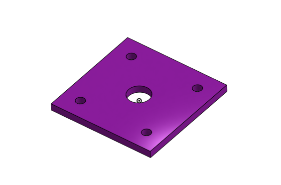
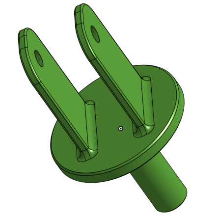
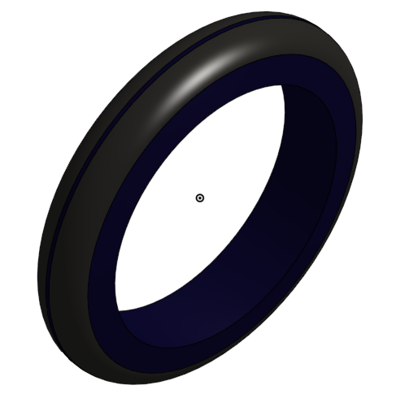

# Basic_Onshape_CAD

## Table of Contents
* [Table of Contents](#Table-of-Contents)
* [Base](#Base)
* [Mount](#Mount)
* [Fork](#Fork)
* [Tire](#Tire)
* [Wheel](#Wheel)
* [AxleCollarBearings](#AxleCollarBearings)

## Base:

### Description
Making the base for the caster
### Evidence
[Base](https://cvilleschools.onshape.com/documents/b7f59dcac0633dd6a51cf67c/w/f829e1386e8839178e00dad1/e/706d8a15176f86e16b580eed)
### Image

### Reflection
Had a bit of trouble with aligning the hole pattern, eventually made some center lines to use as the direction for them, hopefully I did that right, it worked either way

## Mount:

### Description
Making the mount for the caster, pretty much the same as the base, but smaller.
### Evidence
[Mount](https://cvilleschools.onshape.com/documents/b7f59dcac0633dd6a51cf67c/w/f829e1386e8839178e00dad1/e/df5d5dc31249bb90b55d8450)
### Image

### Reflection
I got confused because I was spacing some things from the sides of the circle and not the center, I had a small mental breakdown and then recovered and realized I was spacing from the sides of the circles and that's why the measurements were wrong.

## Fork:

### Description
Making the fork for the caster, it looks kinda like an electrical plug, that's cool.

### Evidence
[Base](https://cvilleschools.onshape.com/documents/b7f59dcac0633dd6a51cf67c/w/f829e1386e8839178e00dad1/e/807f7dd93d44c20e9203e943)
### Image

### Reflection
If I'm to be honest, I really had no trouble with it, but my friend had trouble mirroring so just make sure that when you're mirroring in Onshape it's set to feature mirror, because the default is part mirror and you don't want that.

## Tire

### Description
Making the tire to eventually fit on the wheel of the caster.

### Evidence
[Base](https://cvilleschools.onshape.com/documents/b7f59dcac0633dd6a51cf67c/w/f829e1386e8839178e00dad1/e/e347ddfb4279ae80f613a92e)
### Image

### Reflection 
Had a bit of trouble at the beginning figuring out those awful dimensions, then I realized there was a whole guide on how to do it on the canvas assignment! So the take away for this one is to always read through the asssignment fully, first.
