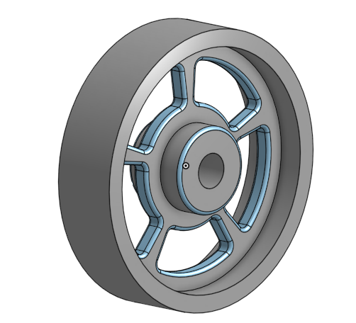
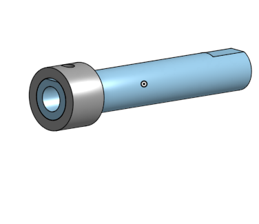
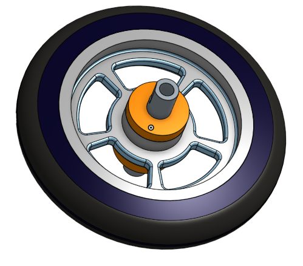
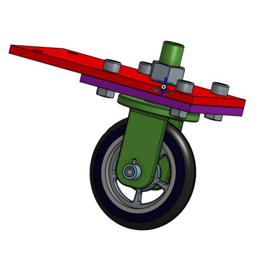

# Basic_Onshape_CAD

## Table of Contents
* [Table of Contents](#Table-of-Contents)
* [Base](#Base)
* [Mount](#Mount)
* [Fork](#Fork)
* [Tire](#Tire)
* [Wheel](#Wheel)
* [AxleCollarBearings](#AxleCollarBearings)
* [SubAssembly](#SubAssembly)
* [FinalAssembly](#FinalAssembly)

## Base:

### Description
Making the base for the caster
### Evidence
[Base](https://cvilleschools.onshape.com/documents/b7f59dcac0633dd6a51cf67c/w/f829e1386e8839178e00dad1/e/706d8a15176f86e16b580eed)
### Image

### Reflection
Had a bit of trouble with aligning the hole pattern, eventually made some center lines to use as the direction for them, hopefully I did that right, it worked either way

## Mount:

### Description
Making the mount for the caster, pretty much the same as the base, but smaller.
### Evidence
[Mount](https://cvilleschools.onshape.com/documents/b7f59dcac0633dd6a51cf67c/w/f829e1386e8839178e00dad1/e/df5d5dc31249bb90b55d8450)
### Image

### Reflection
I got confused because I was spacing some things from the sides of the circle and not the center, I had a small mental breakdown and then recovered and realized I was spacing from the sides of the circles and that's why the measurements were wrong.

## Fork:

### Description
Making the fork for the caster, it looks kinda like an electrical plug, that's cool.

### Evidence
[Fork](https://cvilleschools.onshape.com/documents/b7f59dcac0633dd6a51cf67c/w/f829e1386e8839178e00dad1/e/807f7dd93d44c20e9203e943)
### Image

### Reflection
If I'm to be honest, I really had no trouble with it, but my friend had trouble mirroring so just make sure that when you're mirroring in Onshape it's set to feature mirror, because the default is part mirror and you don't want that.

## Tire

### Description
Making the tire to eventually fit on the wheel of the caster.

### Evidence
[Tire](https://cvilleschools.onshape.com/documents/b7f59dcac0633dd6a51cf67c/w/f829e1386e8839178e00dad1/e/e347ddfb4279ae80f613a92e)
### Image

### Reflection 
Had a bit of trouble at the beginning figuring out those awful dimensions, then I realized there was a whole guide on how to do it on the canvas assignment! So the take away for this one is to always read through the asssignment fully, first.

## Wheel

### Description
The wheel for the caster, which the tire will fit onto, spins around a bunch, looks cool, does wheel things.

### Evidence
[Wheel](https://cvilleschools.onshape.com/documents/b7f59dcac0633dd6a51cf67c/w/f829e1386e8839178e00dad1/e/246bc42fea99520cd7830f47)
### Image

### Reflection
Really had no trouble with this one honestly, just remember to make the arc centered on the origin when you're doing the sketch for the spokes and you'll be fine.

## AxleCollarBearings

### Description
Making the axle collar and bearings, which are smaller parts to go into the caster. Axle and collar were made on the same part.

### Evidence
[AxleCollarBearings](https://cvilleschools.onshape.com/documents/b7f59dcac0633dd6a51cf67c/w/f829e1386e8839178e00dad1/e/fcb90a46ce1ce57307eb54da)
### Image

### Reflection
There was a lot of mechanics that were used to make such small parts, but by now I had pretty much mastered everything that went into it so I had no trouble.

## SubAssembly

### Description
The Sub Assembly of the wheel, axle, and bearings, second to last part of the caster, makes the final assembly a bit easier.

### Evidence
[SubAssembly](https://cvilleschools.onshape.com/documents/124740e220be5c0ce3c8b693/w/bbc667f1eb99c0fa8bf9aeaf/e/f99558b30e183c7e7270143e)
### Image

### Reflection
Overall, not too much trouble with this part, but making sure to get the mate connectors right is a bit tricky, make sure you have the part at a good angle to select the connector that you want, and solve the mate before confirming it just to make sure it looks alright.

## FinalAssembly

### Description
The final assembly! A lot going on here, but basically this is what tied all the parts together, what every one of the parts we made went into.

### Evidence
[FinalAssembly](https://cvilleschools.onshape.com/documents/b7f59dcac0633dd6a51cf67c/w/f829e1386e8839178e00dad1/e/a28af72ba04ec2d6b8e8d8cd}
### Image

### Reflection
Didn't have too much trouble with this one, the actual mates between parts were fairly easy, but Onshape gets a little weird when it comes to putting in the bolts, they often end up upside down or something, I'd like to say I have a "trick" or something for getting it the right direction, but I really just moved my mouse around and on and off the hole until it was facing the right way, which took me quite a bit of time but it is what it is. Overall the caster was a fun mini project to learn Onshape, most of the time it kinda felt like I was watching an infomercial for Onshape though, especially when the guide was in the video, there was a lot of "Most CAD programs need you to (something minor) but Onshape allows you to (skip small step) with (complicated feature you need to learn)" I'm just messing around though, Onshape is really nice to work with, and the caster went well.
